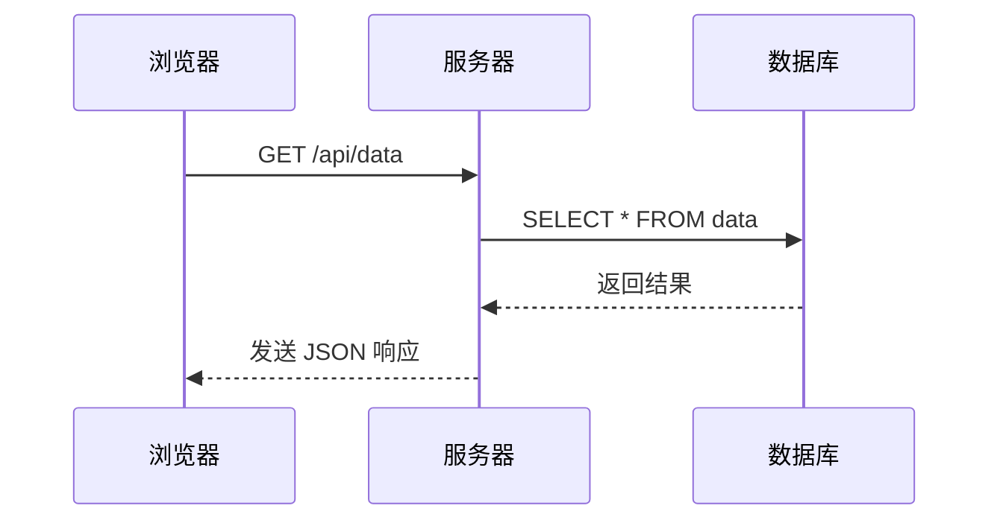

# 关于本站

本站使用 VitePress 构建，托管于 Cloudflare Pages。

## 提交你的文档

如果你想为本站贡献文档，可以通过向管理者发送讯息来进行。我们欢迎任何形式的贡献，包括但不限于：

- 修复错误
- 改进文档
- 添加新内容

请你继续阅读以下内容，感谢你的支持与贡献！

## 文档要求

请使用 Markdown 格式编写你的文档。注意：

- 行内代码请使用单个反引号（`` ` ``）包裹，代码块请使用三重反引号（` ``` `）包裹。**Mermaid 代码块除外**，具体见后文。
- 行内公式请使用美元符号（`$`）包裹，行间公式请使用双美元符号（`$$`）包裹。
- 请确保文档结构清晰、层次分明。
- 请使用适当的标题和子标题来组织内容，一级标题（`#`）不会在页面导航中显示，因此**请将一级标题作为整个文档的大标题使用**，或**不使用一级标题**。

### 文档中显示代码块

对于代码块中特定行的高亮，在前反引号的后面使用 `{}` 包裹行号。例如

````markdown
```typescript{3-5,7}
export default withMermaid(
  defineConfig({
    title: "Akademia",
    lang: 'zh-CN',
    description: "A VitePress Site",
    head: [
      ['link', { rel: 'icon', type: 'image/svg+xml', href: '/favicon.svg' }],
    ]
  })
)
```
````

会显示为

```typescript{3-5,7}
export default withMermaid(
  defineConfig({
    title: "Akademia",
    lang: 'zh-CN',
    description: "A VitePress Site",
    head: [
      ['link', { rel: 'icon', type: 'image/svg+xml', href: '/favicon.svg' }],
    ]
  })
)
```

其中第 `3-5` 行和第 `7` 行高亮显示。

也可以使用在特定行注释 `// [!code highlight]` 来高亮此行，或是通过 `// [!code highlight:<lines>]` 来高亮包括此行及其后的连续 `<lines>` 行。例如

<pre>
```typescript
export default withMermaid(
  defineConfig({
    title: "Akademia", // [!code highlight]
    lang: 'zh-CN',
    description: "A VitePress Site",
    head: [ // [!code highlight:3]
      ['link', { rel: 'icon', type: 'image/svg+xml', href: '/favicon.svg' }],
    ]
  })
)
```
</pre>

会显示为

```typescript
export default withMermaid(
  defineConfig({
    title: "Akademia", // [!code highlight]
    lang: 'zh-CN',
    description: "A VitePress Site",
    head: [ // [!code highlight:3]
      ['link', { rel: 'icon', type: 'image/svg+xml', href: '/favicon.svg' }],
    ]
  })
)
```

在某一行后添加 `// [!code focus]` 注释会聚焦该行，并模糊代码块的其他部分。同理，`// [!code focus:<lines>]` 会聚集从此行开始往后的连续 `<lines>`行。例如

<pre>
```typescript
export default withMermaid(
  defineConfig({
    title: "Akademia", // [!code focus:3]
    lang: 'zh-CN',
    description: "A VitePress Site",
    head: [
      ['link', { rel: 'icon', type: 'image/svg+xml', href: '/favicon.svg' }],
    ]
  })
)
```
</pre>

会显示为

```typescript
export default withMermaid(
  defineConfig({
    title: "Akademia", // [!code focus:3]
    lang: 'zh-CN',
    description: "A VitePress Site",
    head: [
      ['link', { rel: 'icon', type: 'image/svg+xml', href: '/favicon.svg' }],
    ]
  })
)
```

在某一行上添加注释 `// [!code ++]` 或 `// [!code --]` 将标注该行的增减差异。例如

<pre>
```typescript
export default withMermaid(
  defineConfig({
    title: "academy", // [!code --]
    title: "Akademia", // [!code ++]
    lang: 'zh-CN',
    description: "A VitePress Site",
    head: [
      ['link', { rel: 'icon', type: 'image/svg+xml', href: '/favicon.svg' }],
    ]
  })
)
```
</pre>

会显示为

```typescript
export default withMermaid(
  defineConfig({
    title: "academy", // [!code --]
    title: "Akademia", // [!code ++]
    lang: 'zh-CN',
    description: "A VitePress Site",
    head: [
      ['link', { rel: 'icon', type: 'image/svg+xml', href: '/favicon.svg' }],
    ]
  })
)
```

文档中还可以使用 `code-group` 显示代码组，例如

````markdown
::: code-group

```sh [pnpm]
# Build with VitePress using pnpm
pnpm docs:build
```

```sh [npm]
# Build with VitePress using npm
npm run docs:build
```

:::
````

会显示为

::: code-group

```sh [pnpm]
# Build with VitePress using pnpm
pnpm docs:build
```

```sh [npm]
# Build with VitePress using npm
npm run docs:build
```

:::

### 文档中显示容器

文档支持 `INFO`、`TIP`、`NOTE`、`IMPORTANT`、`WARNING`、`CAUTION`、`DANGER` 容器：

> [!INFO]

> [!TIP]
> 这是一条提示，包含有助于用户更顺利达成目标的建议性信息。

> [!NOTE]
> This is a notebook.

> [!IMPORTANT] 牛顿运动定律
> 假若施加于某物体的外力为零，则该物体的运动速度不变。物体的动量随时间的变化率与受力成正比。相互作用的两个物体之间的作用力和反作用力大小相等，方向相反，作用在同一条直线上。

> [!WARNING] 警告
> 这是一条警告。

> [!CAUTION]
> 行为可能带来的负面影响。

> [!DANGER]
> 危险区域，请勿继续！

### 文档中显示 Mermaid 图表

[Mermaid](https://mermaid.js.org/) 是基于 JavaScript 的图表工具，可渲染 Markdown 启发的文本定义以动态创建和修改图表。

若要在文档中显示 Mermaid 图表，**请使用三重反引号包裹的 Mermaid 代码块**，例如：

````markdown

````

会显示为：


### 文档中高亮文本

使用如下格式：

```html
<span class="marker">据说该效果是从尤雨溪大大的主页上拿来的。</span>
```

呈现效果：

> <span class="marker">据说该效果是从尤雨溪大大的主页上拿来的。</span>

### 文档中显示 Iconify 提供的图标

本站文档支持使用 [Iconify](https://iconify.design/) 提供的图标。你可以通过以下方式在文档中插入指定图标：

```html
这包含一个 <Icon icon="devicon-plain:html5"/>HTML 标签。
可以直接在 Icon 组件中使用 href 属性，就像 <Icon icon="devicon-plain:githubcodespaces" href="https://github.com/vuejs/vitepress"/> 这样。
```

显示效果：

> 这包含一个 <Icon icon="devicon-plain:html5"/>HTML 标签。
> 可以直接在 Icon 组件中使用 href 属性，就像 <Icon icon="devicon-plain:githubcodespaces" href="https://github.com/vuejs/vitepress"/> 这样。

注意：由于本站支持明亮/黑暗主题切换，为确保可视性，**请使用单色图标（Monotone）**，慎用彩色图标。

建议不要在文档中滥用图标：

> 开胃菜当然是 <Icon icon="fa7-brands:html5" href="https://www.w3.org/html/"/>HTML5 和 <Icon icon="fa7-brands:css" href="https://www.w3.org/Style/CSS/"/>CSS ——一个负责打底，一个负责打扮，色香味俱全，再配上灵活的 <Icon icon="fa7-brands:js-square" href="https://www.javascript.com/"/>JavaScript，前端就像是街边的“快手小炒”，炒出来总能勾起食欲。
> 要上主菜了：<Icon icon="simple-icons:cplusplus" href="https://isocpp.org/"/>C++ 像是一道老派硬菜，刀工精细却颇费火候；<Icon icon="fa7-brands:python" href="https://www.python.org/"/>Python 则是万能火锅，不论你是搞AI、写脚本还是做科研，什么食材都能涮进去；<Icon icon="fa7-brands:java" href="https://www.java.com/"/>Java 永远端着咖啡壶出场，讲究稳定与仪式感；<Icon icon="fa7-brands:golang" href="https://go.dev/"/> 上菜神速，好比小炒快手菜；而 <Icon icon="fa7-brands:rust" href="https://www.rust-lang.org/"/>Rust 厨师则强调“安全第一”，哪怕慢点，也绝不让你吃坏肚子。
> 做菜的工具当然不能少：<Icon icon="devicon-plain:vscode" href="https://code.visualstudio.com/"/>VS Code 是万能瑞士军刀，几乎人手一把；<Icon icon="fa7-brands:git-alt" href="https://git-scm.com/"/>Git 就像账本，记录下每一步配方；<Icon icon="fa7-brands:linux" href="https://www.linux.org/"/>Linux 和 <Icon icon="fa7-brands:ubuntu" href="https://ubuntu.com/"/>Ubuntu 是那张稳固的铁桌子，不挑食材，啥都能放；<Icon icon="devicon-plain:bash" href="https://www.gnu.org/software/bash/"/>Bash 则像个碎碎念的老伙计，一边干活一边抱怨。要打包？交给 <Icon icon="fa7-brands:docker" href="https://www.docker.com/"/>Docker，装得下世界。
> 调味料方面，La<Icon icon="fa7-brands:tex" href="https://www.latex-project.org/"/> 写得一手精美菜单，<Icon icon="devicon-plain:matlab" href="https://www.mathworks.com/products/matlab.html"/>Matlab 专攻奇怪的数学佐料，而 <Icon icon="fa7-brands:markdown" href="https://daringfireball.net/projects/markdown/"/>Markdown 则用简洁几笔记下菜谱。
> 娱乐环节也安排上：<Icon icon="fa7-brands:bilibili" href="https://www.bilibili.com/"/>B站永远热闹非凡；<Icon icon="fa7-brands:youtube" href="https://www.youtube.com/"/>YouTube 像世界厨艺大赛，什么风味都有；<Icon icon="fa7-brands:steam" href="https://www.steampowered.com/"/>Steam 则邀请大家打完游戏再来一顿夜宵；<Icon icon="fa7-brands:weibo" href="https://www.weibo.com/"/>微博和 <Icon icon="fa7-brands:x-twitter" href="https://x.com/"/> 则负责饭桌上的八卦调剂。
> 查资料的时候，<Icon icon="fa7-brands:wikipedia-w" href="https://www.wikipedia.org/"/>ikipedia 就像随身百科全书，点菜遇到难题时，<Icon icon="fa7-brands:stack-overflow" href="https://stackoverflow.com/"/>Stack Overflow 总有人伸手帮你解围。
> 邻桌也热闹：<Icon icon="fa7-brands:google" href="https://www.google.com/"/>oogle 像全知大厨，啥问题都能搜出答案；<Icon icon="simple-icons:googlegemini" href="https://gemini.google.com/"/>Gemini 喜欢秀一手新鲜花样；<Icon icon="fa7-brands:openai" href="https://openai.com/"/>OpenAI 则递上一碗 AI 汤，清爽解腻；<Icon icon="fa7-brands:apple" href="https://www.apple.com/"/>Apple 摆出的料理精致优雅，价格嘛你懂的；而 <Icon icon="simple-icons:nvidia" href="https://www.nvidia.com/"/>Nvidia 直接上了一锅显卡火锅，光影特效满天飞。
> 最后，用 <Icon icon="fa7-brands:chrome" href="https://www.google.com/chrome/"/>Chrome 来检验菜谱，再通过 <Icon icon="fa7-brands:qq" href="https://www.qq.com/"/>QQ 和 <Icon icon="fa7-brands:weixin" href="https://weixin.qq.com/"/>微信把这场盛宴分享出去。放心，<Icon icon="fa7-brands:android" href="https://www.android.com/"/>Android 还会贴心提醒你饭后走两步，别光顾着写代码不消食。

### 文档中显示时间轴

使用插件提供的 `timeline` 在文档中显示时间轴，用以表示一系列步骤或以时间先后为序的事件。例如

```markdown
::: timeline 2020-04-30
VitePress 0.1.0 版本发布。
:::

::: timeline 2024-03-21
VitePress 1.0.0 版本发布：
- Features:
  - **theme:** allow selectively disabling external link icon on navbar items
:::
```
会显示为

::: timeline 2020-04-30
VitePress 0.1.0 版本发布。
:::

::: timeline 2024-03-21
VitePress 1.0.0 版本发布：
- Features:
  - **theme:** allow selectively disabling external link icon on navbar items
:::

### 文档中提供文件浏览器

本站文档中支持使用 `FileExplorer` 组件来显示文件浏览器。这是一个卡片式文件浏览器插件，可以展示文件的层级结构，并支持直接下载文件。

#### 快速开始

只需要一行代码：

```vue
<FileExplorer configPath="/files/test/structure.json" />
```

显示效果：

<FileExplorer configPath="/files/test/structure.json" />

#### 自动文件大小检测

**无需手动配置！** 文件大小会在构建时自动检测。

本站使用了 `fileStructureGenerator` VitePress 插件，在每次构建时自动：
1. 扫描 `/docs/public/files/` 下的所有子目录
2. 读取每个文件的实际大小
3. 自动生成 `structure.json` 配置文件

这意味着您只需：
- ✅ 将文件放入 `/docs/public/files/your-category/` 目录
- ✅ 运行 `npm run docs:dev` 或 `npm run docs:build`
- ✅ 配置文件自动生成，文件大小 100% 准确

#### 使用方法

**步骤 1：添加文件**

在 `/docs/public/files/` 下创建子目录并放入文件：

```
docs/public/files/
└── my-docs/              # 创建您的分类目录
    ├── guide.pdf
    ├── tutorial.md
    └── assets/
        └── image.png
```

**步骤 2：构建**

```bash
npm run docs:dev
# 或
npm run docs:build
```

插件会自动生成 `my-docs/structure.json`。

**步骤 3：在页面中使用**

```vue
<FileExplorer configPath="/files/my-docs/structure.json" />
```

#### 自动生成的配置示例

以 `/docs/public/files/test/` 为例：

**文件系统：**
```
test/
├── test.md
└── another_folder/
    └── another.md
```

**自动生成的 structure.json：**
```json
[
  {
    "name": "another_folder",
    "type": "folder",
    "children": [
      {
        "name": "another.md",
        "type": "file",
        "path": "/files/test/another_folder/another.md",
        "size": 46
      }
    ]
  },
  {
    "name": "test.md",
    "type": "file",
    "path": "/files/test/test.md",
    "size": 94
  }
]
```

文件大小（`size` 字段）完全自动，无需手动填写！

#### 高级用法

如果不想使用自动生成，也可以直接传入数据：

```vue
<FileExplorer :fileStructure="fileStructure" />

<script setup>
const fileStructure = [
  {
    name: "文档",
    type: "folder",
    children: [
      {
        name: "指南.pdf",
        type: "file",
        path: "/files/documents/指南.pdf",
        size: 1024000  // 可选，会自动检测
      }
    ]
  }
]
</script>
```

#### 可用参数

- `configPath` (可选): JSON 配置文件路径，如 `/files/test/structure.json`
- `fileStructure` (可选): 直接传入的文件结构数组
- `basePath` (可选): 文件基础路径，默认为 `/files/`

**注意**：`configPath` 和 `fileStructure` 至少需要提供一个。优先使用 `fileStructure`（如果提供）。

#### 最佳实践

1. **文件组织**：为每个 FileExplorer 实例创建独立的子目录，例如 `/public/files/documents/`、`/public/files/resources/` 等
2. **自动生成**：推荐使用自动生成方式，确保文件大小始终准确
3. **版本控制**：将自动生成的 `structure.json` 提交到 Git，这样 Cloudflare Pages 部署时可以直接使用
4. **文件命名**：文件名会直接作为显示名称，建议使用有意义的中文名称

#### 技术细节

- **自动大小检测**：使用 Node.js `fs.statSync()` 在构建时读取文件实际大小
- **跨平台一致**：本地开发和 Cloudflare Pages 部署表现完全一致
- **零运行时开销**：不依赖浏览器端的 HTTP 请求检测文件大小
- **VitePress 集成**：作为 Vite 插件在构建过程中自动运行