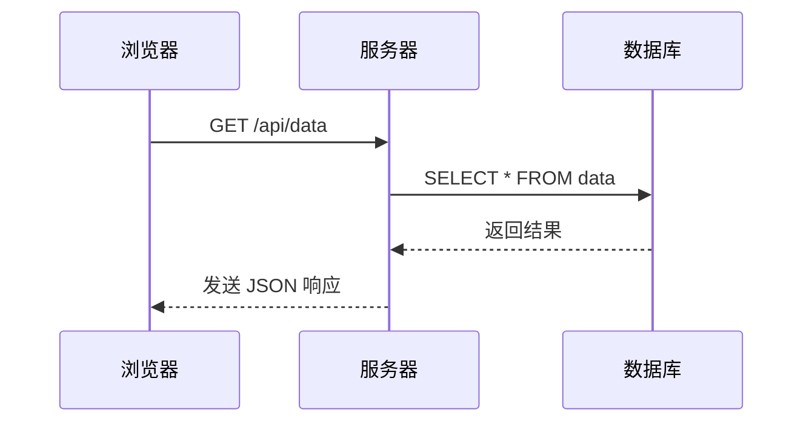

# 关于本站

本站使用 VitePress 构建，托管于 GitHub Pages。

## 提交你的文档

如果你想为本站贡献文档，可以通过向管理者发送讯息来进行。我们欢迎任何形式的贡献，包括但不限于：

- 修复错误
- 改进文档
- 添加新内容

请你继续阅读以下内容，感谢你的支持与贡献！

## 文档要求

请使用 Markdown 格式编写你的文档。注意：

- 行内代码请使用单个反引号（`` ` ``）包裹，代码块请使用三重反引号（` ``` `）包裹。**Mermaid 代码块除外**，具体见后文。
- 行内公式请使用美元符号（`$`）包裹，行间公式请使用双美元符号（`$$`）包裹。
- 请确保文档结构清晰、层次分明。
- 请使用适当的标题和子标题来组织内容，一级标题（`#`）不会在页面导航中显示，因此**请将一级标题作为整个文档的大标题使用**，或**不使用一级标题**。

### 在文档中显示 Mermaid 图表

[Mermaid](https://mermaid.js.org/) 是基于 JavaScript 的图表工具，可渲染 Markdown 启发的文本定义以动态创建和修改图表。

若要在文档中显示 Mermaid 图表，**请使用三重反引号包裹的 Mermaid 代码块**，例如：

````markdown

````

会显示为：


### 在文档中显示 Iconify 提供的图标

本站文档支持使用 [Iconify](https://iconify.design/) 提供的图标。你可以通过以下方式在文档中插入指定图标：

```html
这包含一个 <Icon icon="devicon-plain:html5"/>HTML 标签。
可以直接在 Icon 组件中使用 href 属性，就像 <Icon icon="devicon-plain:githubcodespaces" href="https://github.com/vuejs/vitepress"/> 这样。
```

显示效果：

> 这包含一个 <Icon icon="devicon-plain:html5"/>HTML 标签。
> 可以直接在 Icon 组件中使用 href 属性，就像 <Icon icon="devicon-plain:githubcodespaces" href="https://github.com/vuejs/vitepress"/> 这样。

注意：由于本站支持明亮/黑暗主题切换，为确保可视性，**请使用单色图标（Monotone）**，慎用彩色图标。


<Icon icon="devicon-plain:cplusplus"/>
<Icon icon="fa7-brands:python" href="https://www.python.org/"/>
<Icon icon="fa7-brands:java" href="https://www.java.com/"/>
<Icon icon="fa7-brands:js-square" href="https://www.javascript.com/"/>
<Icon icon="fa7-brands:html5" href="https://www.w3.org/html/"/>
<Icon icon="fa7-brands:css" href="https://www.w3.org/Style/CSS/"/>
<Icon icon="fa7-brands:golang" href="https://go.dev/"/>
<Icon icon="fa7-brands:rust" href="https://www.rust-lang.org/"/>
<Icon icon="fa7-brands:php" href="https://www.php.net/"/>
<Icon icon="fa7-brands:tex" href="https://www.latex-project.org/"/>

<Icon icon="devicon-plain:vscode" href="https://code.visualstudio.com/"/>
<Icon icon="fa7-brands:linux" href="https://www.linux.org/"/>
<Icon icon="fa7-brands:ubuntu" href="https://ubuntu.com/"/>
<Icon icon="fa7-brands:git-alt" href="https://git-scm.com/"/>
<Icon icon="fa7-brands:google" href="https://www.google.com/"/>
<Icon icon="fa7-brands:github" href="https://github.com/"/>
<Icon icon="devicon-plain:bash" href="https://www.gnu.org/software/bash/"/>
<Icon icon="fa7-brands:docker" href="https://www.docker.com/"/>
<Icon icon="fa7-brands:chrome" href="https://www.google.com/chrome/"/>

<Icon icon="fa7-brands:android" href="https://www.android.com/"/>


<Icon icon="devicon-plain:matlab" href="https://www.mathworks.com/products/matlab.html"/>

<Icon icon="fa7-brands:markdown" href="https://daringfireball.net/projects/markdown/"/>

<Icon icon="fa7-brands:openai" href="https://openai.com/"/>

<Icon icon="simple-icons:googlegemini" href="https://gemini.google.com/"/>

<Icon icon="fa7-brands:wikipedia-w" href="https://www.wikipedia.org/"/>

<Icon icon="fa7-brands:bilibili" href="https://www.bilibili.com/"/>

<Icon icon="fa7-brands:qq" href="https://www.qq.com/"/>

<Icon icon="fa7-brands:weixin" href="https://weixin.qq.com/"/>

<Icon icon="fa7-brands:x-twitter" href="https://x.com/"/>

<Icon icon="fa7-brands:apple" href="https://www.apple.com/"/>

<Icon icon="fa7-brands:youtube" href="https://www.youtube.com/"/>

<Icon icon="fa7-brands:stack-overflow" href="https://stackoverflow.com/"/>

<Icon icon="fa7-brands:steam" href="https://www.steampowered.com/"/>

<Icon icon="fa7-brands:weibo" href="https://www.weibo.com/"/>

<Icon icon="simple-icons:nvidia" href="https://www.nvidia.com/"/>