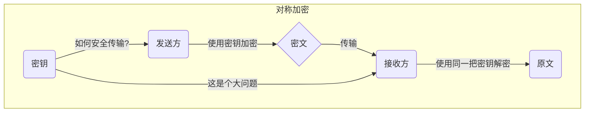
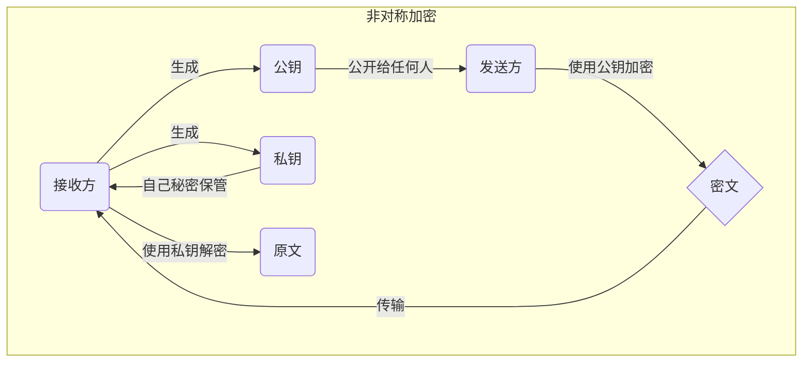

# 非对称加密与 RSA 加密算法

欢迎来到密码学的世界！这篇教程将带领你走近现代网络安全的基石——非对称加密，并详细解析其中最著名、应用最广泛的 **RSA 算法**。无论你是未来的计算机科学家、软件工程师还是网络安全专家，理解 RSA 的工作原理都将为你打开一扇通往安全领域的大门。

## 告别“对称”：为什么需要非对称加密？

在探讨非对称加密之前，我们先来了解一下它前辈——**对称加密**。

想象一下，你想给朋友寄一个锁上的箱子，里面装着秘密信息。你用一把钥匙锁上箱子，然后把箱子寄给朋友。但问题来了：你的朋友没有钥匙，打不开箱子。为了让他能打开，你必须把钥匙也送给他。可如果邮寄钥匙，万一钥匙被坏人截获，那秘密信息也就随之泄露了。

这就是对称加密面临的困境。加密和解密使用同一把“钥匙”（密钥），如何安全地把这把密钥交给通信的另一方，成了一个巨大的难题。这被称为“密钥分发难题”。



为了解决这个问题，三位杰出的科学家 Whitfield Diffie、Martin Hellman 和 Ralph Merkle 在1976年提出了一个革命性的构想，开创了“非对称加密”的时代。

非对称加密，又称“公钥加密”，巧妙地使用了**两把**配对的密钥：

1.  **公钥 (Public Key)**：这把钥匙是公开的，任何人都可以获取。就像一个开放的信箱投递口，任何人都可以把信投进去。
2.  **私钥 (Private Key)**：这把钥匙是保密的，只有你自己持有。就像信箱的取信钥匙，只有你能打开信箱，读取信件。

通信过程如下：

*   **接收方** 首先生成一对密钥（公钥和私钥），并把公钥发布出去。
*   **发送方** 想要发送信息时，使用接收方的**公钥**对信息进行加密。
*   **接收方** 收到加密信息后，使用自己的**私钥**进行解密。

关键在于：**公钥加密的信息，只有与之配对的私钥才能解开**。只要私钥不泄露，通信就是安全的。这就完美地解决了密钥分发的问题，因为需要保密的私钥自始至终都没有离开过接收方。



1977年，三位数学家 Rivest、Shamir 和 Adleman 设计出了一种可以实现非对称加密的强大算法，并以他们姓氏的首字母命名，这就是我们今天的主角——**RSA 算法**。

## RSA 的数学基石

RSA 算法的安全性并非凭空而来，它建立在几个坚实的数论概念之上。别担心，这些概念远比它们的名字听起来要简单。

### 互质关系 (Coprime)

如果两个正整数，除了公约数 1 以外，再没有其他的公约数，我们就称这两个数**互质**。

例如，15 和 32。15的约数有1, 3, 5, 15；32的约数有1, 2, 4, 8, 16, 32。它们唯一的公约数是1，所以15和32互质。

**重要结论：**
*   任意两个质数一定互质。例如 13 和 61。
*   一个质数和一个不被它整除的数互质。例如 7 和 10。
*   1 和任意正整数都互质。

### 欧拉函数 (Euler's Totient Function)

欧拉函数，记作 $\phi(n)$，是用来计算“在小于或等于 n 的正整数中，有多少个与 n 互质的数”。

例如，计算 $\phi(8)$。在1到8中，与8互质的数有 1, 3, 5, 7，共4个。所以 $\phi(8) = 4$。

欧拉函数的计算有以下几种情况：

1.  **如果 n = 1**，则 $\phi(1) = 1$。
2.  **如果 n 是质数 p**，则 $\phi(p) = p-1$。因为质数 p 与所有小于它的数（1, 2, ..., p-1）都互质。
3.  **如果 n 是质数 p 的 k 次方，即 $n = p^k$**，则 $\phi(p^k) = p^k - p^{k-1} = p^k(1 - \frac{1}{p})$。
4.  **如果 n 可以分解为两个互质整数的乘积，即 $n = p_1 \times p_2$**，则 $\phi(n) = \phi(p_1) \times \phi(p_2)$。

基于以上性质，我们可以推导出欧拉函数的通用计算公式。如果正整数 n 分解质因数为 $n = p_1^{k_1} p_2^{k_2} \cdots p_r^{k_r}$，则：
$$ \phi(n) = n \left(1 - \frac{1}{p_1}\right) \left(1 - \frac{1}{p_2}\right) \cdots \left(1 - \frac{1}{p_r}\right) $$
在RSA算法中，我们最常用到的是第四种情况的一个特例：当 n 是两个不同质数 p 和 q 的乘积时，$n = pq$。
$$ \phi(n) = \phi(p) \times \phi(q) = (p-1)(q-1) $$
这个公式是 RSA 算法的核心，请一定记住它。

### 模运算与欧拉定理

在介绍欧拉定理之前，我们需要先了解一个基础概念：**模运算 (Modular Arithmetic)**。

模运算也叫求余运算，用符号 `mod` 表示。$a \equiv b \pmod{n}$ 读作“a 同余于 b 模 n”，它意味着 **a 和 b 被 n 除得到的余数相同**。

例如，$10 \equiv 3 \pmod{7}$，因为10除以7余3，3除以7也余3。$100 \equiv 2 \pmod{7}$，因为100除以7余2。

**欧拉定理 (Euler's Theorem)**

欧拉定理的内容是：如果正整数 $a$ 和 $n$ **互质**，那么下面的等式成立：
$$ a^{\phi(n)} \equiv 1 \pmod{n} $$
这意味着，$a$ 的 $\phi(n)$ 次方被 $n$ 除，余数恒为 1。

例如，我们来验证 $a=3, n=10$。它们互质。$\phi(10) = 10(1-\frac{1}{2})(1-\frac{1}{5}) = 4$。根据欧拉定理，$3^4 \equiv 1 \pmod{10}$。计算一下，$3^4 = 81$，81除以10确实余1。

欧拉定理是 RSA 加解密能够成立的根本原因。

### 模反元素 (Modular Multiplicative Inverse)

模反元素听起来很复杂，但其实就是模运算下的“倒数”。

如果两个正整数 $a$ 和 $n$ 互质，那么我们一定能找到一个整数 $d$，使得 $a \times d$ 被 $n$ 除的余数是 1。
$$ a \cdot d \equiv 1 \pmod{n} $$
这时，我们就称 $d$ 是 $a$ 关于模 $n$ 的**模反元素**。

例如，求 3 关于模 11 的模反元素。我们需要找到一个 $d$ 使得 $3d \equiv 1 \pmod{11}$。我们可以简单地试一下：
*   $3 \times 1 = 3 \pmod{11}$
*   $3 \times 2 = 6 \pmod{11}$
*   $3 \times 3 = 9 \pmod{11}$
*   $3 \times 4 = 12 \equiv 1 \pmod{11}$

我们找到了！$d=4$ 就是 3 关于模 11 的一个模反元素。实际上，所有满足 $4+11k$（k为整数）形式的数都是它的模反元素。在密码学中，我们通常取最小的那个正整数解。

如何高效地计算模反元素呢？通常使用“扩展欧几里得算法”。不过现在，你只需要理解它的概念即可。

## 深入 RSA 算法：密钥的诞生与信息的传递

有了前面的数学知识铺垫，我们现在可以完整地走一遍 RSA 的流程了。我们以一个具体的例子来说明。

### 密钥生成过程

假设现在Alice想要生成一套自己的公钥和私钥，她需要遵循以下步骤：

1.  **第一步：选择两个不相等的质数 $p$ 和 $q$。**
    Alice 选择了 $p=61$ 和 $q=53$。（在实际应用中，这两个质数会非常非常大，通常是几百位的数字）。

2.  **第二步：计算 $p$ 和 $q$ 的乘积 $n$。**
    $n = p \times q = 61 \times 53 = 3233$
    这个 $n$ 会成为公钥和私钥的一部分。$n$ 的二进制位数就是密钥的长度。3233的二进制是`110010100001`，长度为12位。实际应用中，RSA密钥长度通常为1024位或2048位。

3.  **第三步：计算 $n$ 的欧拉函数 $\phi(n)$。**
    根据我们之前的公式：$\phi(n) = (p-1)(q-1)$
    $\phi(3233) = (61-1)(53-1) = 60 \times 52 = 3120$

4.  **第四步：随机选择一个整数 $e$。**
    $e$ 必须满足两个条件：$1 < e < \phi(n)$，且 $e$ 与 $\phi(n)$ 互质。
    Alice 在 1 到 3120 之间，选择了一个满足条件的数 $e=17$。（在实际应用中，为了计算效率，常常选择 65537）。

5.  **第五步：计算 $e$ 对于 $\phi(n)$ 的模反元素 $d$。**
    我们需要找到一个 $d$，使得 $e \cdot d \equiv 1 \pmod{\phi(n)}$。
    也就是 $17 \cdot d \equiv 1 \pmod{3120}$。
    这个方程等价于 $17d - 1 = k \cdot 3120$，可以通过扩展欧几里得算法解出。这里我们直接给出结果：$d=2753$（因为 $17 \times 2753 = 46801 = 15 \times 3120 + 1$）。

6.  **第六步：封装公钥和私钥。**
    *   **公钥**由 $(n, e)$ 组成：$(3233, 17)$
    *   **私钥**由 $(n, d)$ 组成：$(3233, 2753)$

至此，Alice的密钥对就生成完毕。她可以将公钥 $(3233, 17)$ 公布给任何人，而将私钥 $(3233, 2753)$ 妥善保管。

### 加密与解密过程

现在，假设Bob想给Alice发送一条秘密消息。为了简化，我们假设消息是一个数字 `m` (在实际应用中，文本信息可以转换为数字)。**注意：消息 $m$ 必须小于 $n$**。

假设Bob要发送的消息是 $m = 65$。

**加密（Bob使用Alice的公钥）**

Bob拿到了Alice的公钥 $(n=3233, e=17)$。他使用以下公式计算密文 $c$：
$$ c \equiv m^e \pmod{n} $$
代入数值：
$$ c \equiv 65^{17} \pmod{3233} $$
这个计算结果是 $c = 2790$。
于是，Bob将密文 2790 发送给Alice。

**解密（Alice使用自己的私钥）**

Alice收到了Bob发来的密文 $c = 2790$。她拿出自己的私钥 $(n=3233, d=2753)$，并使用以下公式恢复原文 $m$：
$$ m \equiv c^d \pmod{n} $$
代入数值：
$$ m \equiv 2790^{2753} \pmod{3233} $$
这个计算结果正是 $m = 65$。
Alice成功解密，获取了Bob的原始消息。

整个过程中，即使有攻击者窃听了网络，他只能拿到公钥 $(3233, 17)$ 和密文 $2790$。想要解密，就必须知道私钥中的 $d$。而想要计算出 $d$，就必须先知道 $\phi(n)$，而要知道 $\phi(n)$，就必须先知道 $p$ 和 $q$。

这就引出了RSA安全性的核心。

## RSA 算法的可靠性

攻击者已知 $(n, e)$，想要推导出 $d$，需要完成以下破解链条：
`d` <- `φ(n)` <- (`p`, `q`) <- `n`

结论很明确：**如果能将 $n$ 因数分解成 $p \times q$，RSA 算法就会被破解**。

对于我们例子中的 $n=3233$，你可能很快就能分解出它是 $61 \times 53$。但如果 $n$ 是一个几百位的巨大整数呢？对极大整数进行因数分解是一项极其困难的数学挑战。 目前已知的最快算法也需要消耗海量的计算资源和时间。

迄今为止，被公开破解的最长RSA密钥是768位，由数百台计算机花费了两年时间才完成。 因此，只要密钥长度足够长（例如2048位或更长），目前的计算能力是无法在有效时间内将其破解的，这保证了RSA算法的安全性。

## 上手实操环节

理论知识已经足够了，现在让我们亲自动手来感受一下RSA的魅力！

### 纸上谈兵：亲手实践

我们来用一组更小的数字，手动完成一次完整的RSA流程。

1.  **生成密钥**
    *   **第一步：** 选择 $p=3, q=11$。
    *   **第二步：** 计算 $n = p \times q = 3 \times 11 = 33$。
    *   **第三步：** 计算 $\phi(n) = (3-1)(11-1) = 2 \times 10 = 20$。
    *   **第四步：** 选择一个 $e$，要求 $1 < e < 20$ 且与 20 互质。我们选择 $e=7$。（3, 7, 9, 11, 13, 17, 19 都可以）
    *   **第五步：** 计算 $d$，使得 $7d \equiv 1 \pmod{20}$。
        我们可以简单尝试一下：$7 \times 1=7, 7 \times 2=14, 7 \times 3=21 \equiv 1 \pmod{20}$。所以 $d=3$。
    *   **第六步：** 得到密钥对。
        *   公钥：$(n, e) = (33, 7)$
        *   私钥：$(n, d) = (33, 3)$

2.  **加密与解密**
    *   假设要加密的消息是 $m=5$。
    *   **加密：** $c \equiv m^e \pmod n \equiv 5^7 \pmod{33}$。
        $5^1 = 5$
        $5^2 = 25$
        $5^3 = 125 \equiv 26 \pmod{33}$
        $5^4 \equiv 25 \times 5 \equiv 125 \equiv 26 \pmod{33}$
        $5^7 = 5^3 \times 5^4 \equiv 26 \times 26 = 676$
        $676 \div 33 = 20$ 余 $16$。
        所以密文 $c = 16$。
    *   **解密：** $m \equiv c^d \pmod n \equiv 16^3 \pmod{33}$。
        $16^2 = 256$。 $256 \div 33 = 7$ 余 $25$。所以 $16^2 \equiv 25 \pmod{33}$。
        $16^3 = 16^2 \times 16 \equiv 25 \times 16 = 400$。
        $400 \div 33 = 12$ 余 $4$。
        等等，解密结果是4，不是5，哪里出错了？让我们重新计算加密过程。
        $5^7 = 78125$。
        $78125 \div 33 = 2367$ 余 $14$。
        啊哈，手动计算 $5^7 \pmod{33}$ 时出错了。正确的密文 $c=14$。
        
        让我们用正确的密文重新解密：
    *   **用 $c=14$ 解密：** $m \equiv 14^3 \pmod{33}$。
        $14^2 = 196$。 $196 \div 33 = 5$ 余 $31$。所以 $14^2 \equiv 31 \equiv -2 \pmod{33}$。
        $14^3 = 14^2 \times 14 \equiv 31 \times 14 = 434$。
        $434 \div 33 = 13$ 余 $5$。
        所以原文 $m = 5$。解密成功！

这个小插曲也告诉我们，在密码学中，每一步计算都必须精确无误。

### 代码演练：使用 Python 实现 RSA

下面是一个简单的Python代码，实现了RSA算法的核心流程。你可以直接运行它来体验。

```python
# Python 3
import random

def is_prime(n):
    """检查一个数是否为质数"""
    if n <= 1:
        return False
    for i in range(2, int(n**0.5) + 1):
        if n % i == 0:
            return False
    return True

def gcd(a, b):
    """计算最大公约数 (Euclidean Algorithm)"""
    while b != 0:
        a, b = b, a % b
    return a

def extended_gcd(a, b):
    """扩展欧几里得算法，用于计算模反元素"""
    if a == 0:
        return b, 0, 1
    d, x1, y1 = extended_gcd(b % a, a)
    x = y1 - (b // a) * x1
    y = x1
    return d, x, y

def mod_inverse(e, phi):
    """计算模反元素 d"""
    d, x, y = extended_gcd(e, phi)
    if d != 1:
        raise Exception('e 和 phi(n) 不互质，无法计算模反元素')
    return x % phi

def generate_keypair(p, q):
    """根据 p 和 q 生成密钥对"""
    if not (is_prime(p) and is_prime(q)):
        raise ValueError('p 和 q 都必须是质数')
    elif p == q:
        raise ValueError('p 和 q 不能相等')

    n = p * q
    phi = (p - 1) * (q - 1)

    # 选择 e，通常从一个小的奇数开始
    e = random.randrange(3, phi, 2)
    while gcd(e, phi) != 1:
        e = random.randrange(3, phi, 2)

    # 计算 d
    d = mod_inverse(e, phi)
    
    # 返回公钥 (n, e) 和私钥 (n, d)
    return ((n, e), (n, d))

def encrypt(public_key, plaintext):
    """使用公钥加密"""
    n, e = public_key
    # m^e mod n
    cipher_text = pow(plaintext, e, n)
    return cipher_text

def decrypt(private_key, ciphertext):
    """使用私钥解密"""
    n, d = private_key
    # c^d mod n
    plain_text = pow(ciphertext, d, n)
    return plain_text

# --- 主程序 ---
if __name__ == '__main__':
    # 1. 选择两个质数
    p = 61
    q = 53
    
    print(f"选择的质数: p={p}, q={q}")
    
    # 2. 生成密钥对
    public_key, private_key = generate_keypair(p, q)
    print(f"生成的公钥 (n, e): {public_key}")
    print(f"生成的私钥 (n, d): {private_key}")
    
    # 3. 待加密的消息
    message = 1234
    print(f"\n原文消息: {message}")
    
    # 4. 加密
    encrypted_message = encrypt(public_key, message)
    print(f"加密后的密文: {encrypted_message}")
    
    # 5. 解密
    decrypted_message = decrypt(private_key, encrypted_message)
    print(f"解密后的原文: {decrypted_message}")

    if message == decrypted_message:
        print("\n成功！原文与解密后的消息一致。")
    else:
        print("\n失败！解密错误。")

```

## 最后的证明：为什么解密一定有效？

我们来从数学上证明为什么 $m \equiv c^d \pmod n$ 一定能得到原始的 $m$。
证明的核心是证明：
$$ m^{ed} \equiv m \pmod n $$
根据加密和解密的定义，$c \equiv m^e \pmod n$，而解密过程是 $c^d \pmod n$，这等同于 $(m^e)^d = m^{ed}$。
又根据 $d$ 的定义，我们知道 $ed \equiv 1 \pmod{\phi(n)}$。所以 $ed$ 可以写成 $k\phi(n) + 1$ 的形式，其中 $k$ 是某个整数。
于是，我们需要证明的是：
$$ m^{k\phi(n)+1} \equiv m \pmod n $$

证明分为两种情况：

1.  **$m$ 与 $n$ 互质**
    根据欧拉定理，$m^{\phi(n)} \equiv 1 \pmod n$。
    因此，$m^{k\phi(n)+1} = (m^{\phi(n)})^k \cdot m^1 \equiv 1^k \cdot m \equiv m \pmod n$。
    证明成立。

2.  **$m$ 与 $n$ 不互质**
    因为 $n=pq$ 是两个质数的乘积，所以如果 $m$ 与 $n$ 不互质，则 $m$ 必然是 $p$ 的倍数或 $q$ 的倍数。
    我们以 $m = c \cdot p$ 为例（$c$ 为某个整数）。
    在这种情况下，我们需要分别证明 $m^{ed} \equiv m \pmod p$ 和 $m^{ed} \equiv m \pmod q$。根据中国剩余定理，如果这两个式子都成立，那么原式 $m^{ed} \equiv m \pmod n$ 也成立。
    *   对于模 $p$：$m = cp$，所以 $m \equiv 0 \pmod p$。显然 $m^{ed} \equiv 0^{ed} \equiv 0 \pmod p$。所以 $m^{ed} \equiv m \pmod p$ 成立。
    *   对于模 $q$：由于 $m$ 是 $p$ 的倍数，且 $p,q$ 是不同的质数，所以 $m$ 和 $q$ 互质。根据欧拉定理的特例——费马小定理，$m^{q-1} \equiv 1 \pmod q$。
        我们知道 $ed = k\phi(n) + 1 = k(p-1)(q-1) + 1$。
        所以 $m^{ed} = m^{k(p-1)(q-1)+1} = (m^{q-1})^{k(p-1)} \cdot m \equiv 1^{k(p-1)} \cdot m \equiv m \pmod q$。
        此式也成立。

两种情况都证明了 $m^{ed} \equiv m \pmod n$ 恒成立。这从数学上保证了RSA算法的正确性。

## 总结

我们从对称加密的困境出发，理解了非对称加密的巧妙思想，深入学习了其背后的数论原理（互质、欧拉函数、欧拉定理），并一步步地掌握了密钥生成、加密和解密的完整流程。

RSA 算法不仅仅是密码学教科书上的一个章节，它支撑着我们日常数字生活的方方面面，从HTTPS网页浏览、电子邮件加密到数字签名，无处不在。希望这篇教程能成为你探索广阔的密码学与信息安全世界的起点。